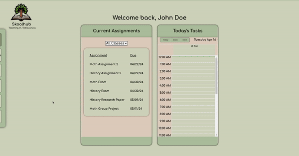

<h1 align="center">Welcome, I'm Michael O'Brien</h1>
<h3 align="center">A passionate Full Stack Engineer with a background in Logistics plus a love for dogs and Dungeons & Dragons</h3>

<h3 align="left">Technologies:</h3>

<h3>Languages</h3>

 
<h3>Full Stack</h3>

 
<h3>Deployment & Testing</h3>

- Hi, I'm a component serving as a piece of a larger E-Commerce application. They call me [Atelier Front End Product Detail Component](https://github.com/Atelier-front-end-Product-Detail/Atelier-front-end-Product-Detail-component)

  

- Hi, I'm a lightning fast service based backend called [Atelier Back End System Redesign](https://github.com/Atelier-System-Redesign/Products-SDC/blob/main/README.md)

- Hi, I'm an Education Management System. I take the tedium out of teaching. You can call me [SkoolHub](https://github.com/skoolhub-tech/SkoolHub)
  

<h3 align="left">Connect with me:</h3>

&nbsp;

